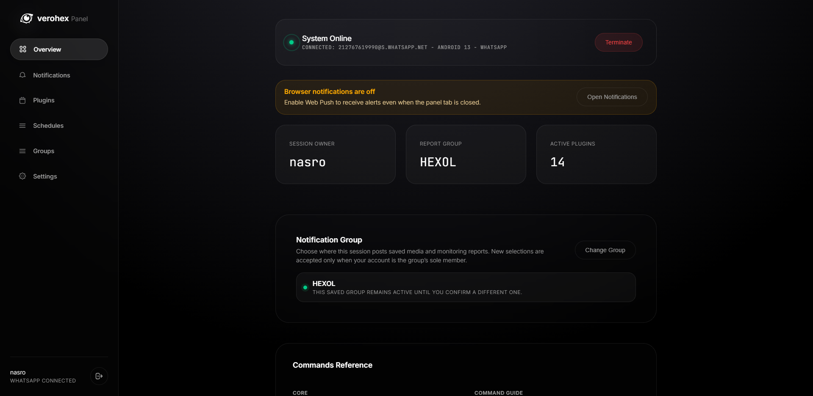
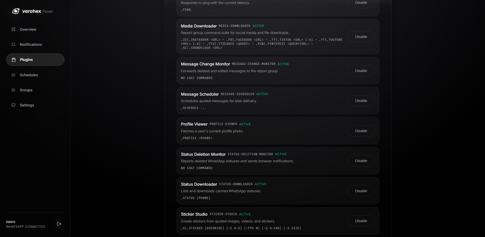
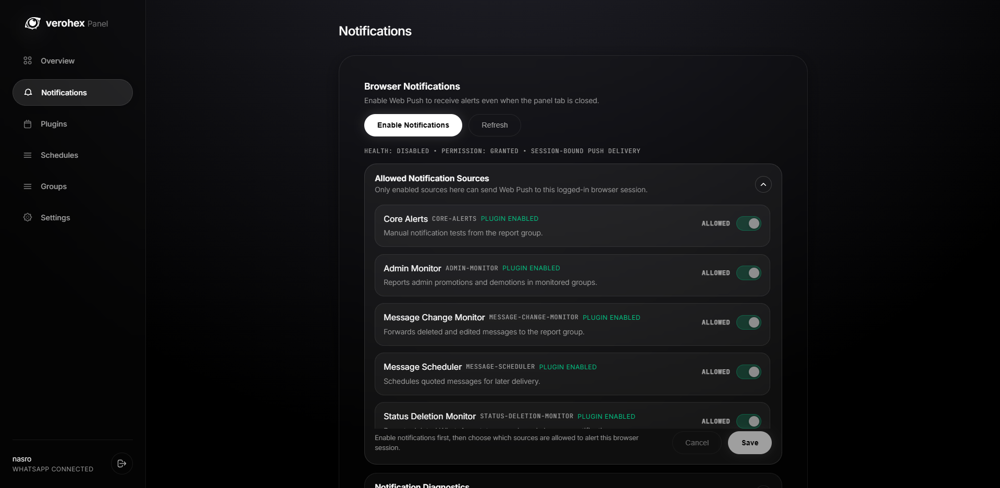
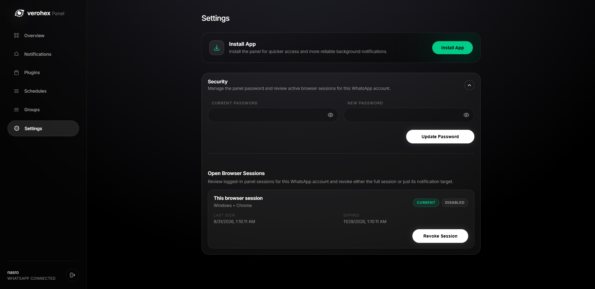
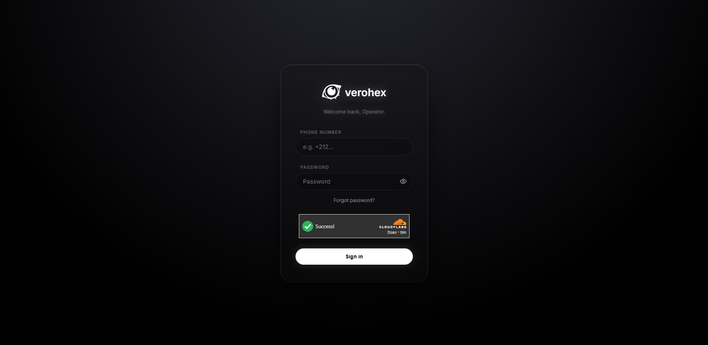
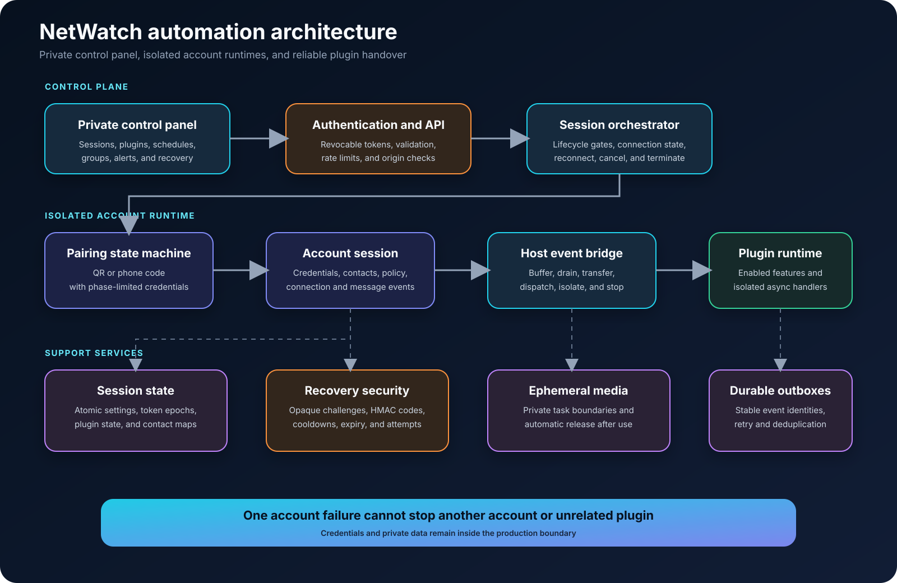

# NetWatch

NetWatch gives people more control over their own WhatsApp account. I built it to add practical automation and utilities that the standard app does not provide in one place: scheduled messages, group tools, account alerts, sticker creation, media tools, and more.

People connect their own account, choose the tools they want, and control them from a private panel. The panel is only the control surface; the main product is the automation engine and its plugin system.

I started NetWatch in **November 2025**.

## What NetWatch can do

- Connect an account with a QR code or phone-linking code.
- Schedule messages for a later time.
- Manage groups and common administrative tasks.
- Receive alerts about disconnects and important account changes.
- Monitor message edits, deletions, group roles, and status changes.
- Create stickers, find GIFs, and use convenient media tools.
- Keep several accounts separate and manage each one independently.
- Recover panel access through a verified connected account.

## Useful plugins

NetWatch is modular: each person enables only the features they need.

| Plugin | What it does |
| --- | --- |
| Message Scheduler | Sends a prepared message at the chosen time. |
| Group Manager | Makes frequent group administration tasks easier. |
| Admin Monitor | Reports important changes to group administrators. |
| Message Change Monitor | Notifies the account owner when a message is edited or deleted. |
| Status Deletion Monitor | Reports when a previously visible status is removed. |
| Sticker Studio | Turns an image or short animation into a WhatsApp sticker. |
| Media Downloader | Retrieves supported media when the owner requests it. |
| GIF Finder | Finds and prepares a GIF from a simple search. |
| Status Downloader | Lets the owner retrieve a currently available status. |
| Profile Viewer | Shows useful public information about a selected contact. |
| Voice Spoofer | Sends compatible audio in WhatsApp's voice-note format. |
| Latency Checker | Checks whether the connected account and service are responding. |
| Command Guide | Explains available commands inside WhatsApp. |
| View-once Forwarder | Intercepts a view-once media. |

The production platform contains **15 plugins** across automation, administration, monitoring, recovery, and media workflows.

## Product preview

These screenshots show the private control panel. Its source code is intentionally not part of this repository.

<p align="center">
  
</p>

<p align="center">
  
  
</p>

<p align="center">
  
  
</p>

## Privacy by design

I designed NetWatch around account separation and minimal exposure.

- Every connected account runs in its own isolated session.
- Media handling is private and ephemeral. Media exists only while the requested action is active and is released immediately when the action finishes or fails.
- Plugins receive only the event and account context needed for their task.
- Pairing details are available only during the correct connection phase and are excluded from logs.
- Credentials, messages, account data, and production configuration remain inside the private production boundary.

## How it works



The private panel sends a request to the automation platform. NetWatch then routes it to the correct isolated account and enabled plugin.

### Connecting an account

1. The owner starts a connection from the private panel.
2. NetWatch creates an isolated session for that account.
3. The owner uses either a QR code or a phone-linking code.
4. NetWatch checks that the credentials are complete before marking the account ready.
5. If the attempt is cancelled or replaced, late events from the old attempt cannot take over the session.

### Running an automation

1. A message, account event, schedule, or owner command reaches the account runtime.
2. The runtime turns it into a consistent internal event.
3. The event bridge sends it only to the plugins enabled for that account.
4. Each plugin runs independently, so one failure does not stop other plugins or accounts.
5. Results and notifications are returned to the owner through the appropriate private channel.

### Handling media

1. NetWatch confirms that the request belongs to the active account.
2. The media is made available only to the plugin handling that specific action.
3. Processing stays within the task's private scope.
4. The media is released immediately after success, failure, or cancellation.
5. Interrupted work is cleaned up automatically when the service resumes.

### Recovering panel access

1. The owner requests recovery without revealing whether an account exists.
2. NetWatch creates a short-lived, opaque challenge.
3. A one-time code is delivered through the verified connected account.
4. Only a keyed fingerprint of the code is used for verification.
5. Expiry, attempt limits, cooldowns, and single-use rules prevent replay and guessing.

## Safety and reliability

- **Session isolation:** one account failure cannot stop another account.
- **Lifecycle gates:** overlapping connect, reconnect, cancel, and logout actions cannot corrupt the current session.
- **Safe pairing:** QR codes and phone-linking codes are exposed only in the correct phase.
- **Private recovery:** reset requests use generic responses and bounded, one-time challenges.
- **Reliable events:** events are buffered during plugin startup or replacement, then handed over without avoidable gaps.
- **Failure isolation:** a slow or faulty plugin cannot block unrelated handlers.
- **Duplicate protection:** stable event identities prevent repeated alerts and recovery actions.
- **Controlled notifications:** the account's notification group is verified before it becomes an alert destination.
- **Ephemeral media:** strict task boundaries and automatic cleanup protect media during processing.

## Technology

The production platform uses Node.js, Express, Socket.IO, Baileys, MySQL, SQLite, web push, FFmpeg, Sharp, and a progressive web application. The public tests use only Node.js built-in tools.

## Tests

Use Node.js 20 or newer.

```bash
npm ci
npm test
npm run test:coverage
```

The test suite covers connection state, session safety, password recovery, plugin event handover, alert deduplication, and ephemeral media cleanup.

See [SECURITY.md](SECURITY.md) for responsible reporting and [NOTICE.md](NOTICE.md) for usage terms.
